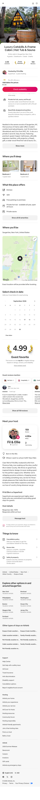
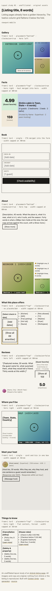
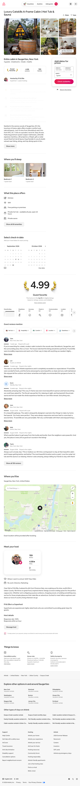
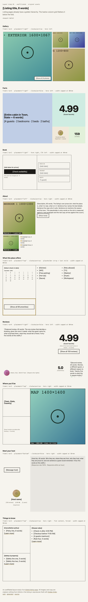
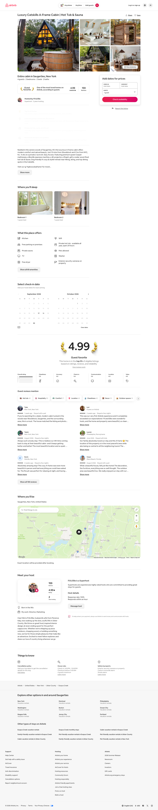
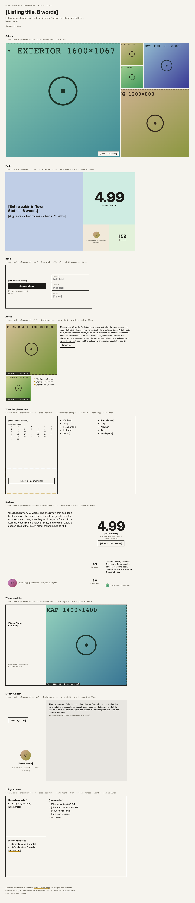

# Layout study 01 — an Airbnb listing page

**Live:** https://gregoryedgerton.github.io/golden-grids-study-01-airbnb/

An unaffiliated layout study. It rebuilds the structure of a named page using
stacked golden grids, so the comparison is between two ways of laying out the
same content hierarchy. All imagery and copy here are original. Nothing from
Airbnb or the listing — photography, wordmarks, marketing copy — is reproduced.

Built with [Golden Grids](https://github.com/gregoryedgerton/golden-grids)
([npm](https://www.npmjs.com/package/@gifcommit/golden-grids) ·
[generator](https://gregoryedgerton.github.io/golden-grids/)), from the
[study template](https://github.com/gregoryedgerton/golden-grids-study-template).

> **Status: pass one.** The structure is built and every slot is inventoried
> in the asset spec below. Every image and copy slot holds an obviously
> placeholder stand-in at the resolution or word count the spec asks for.
> Pass two replaces them with original assets produced against the spec.

---

## Reference

**Page:** a single-property listing on airbnb.com — "Luxury Catskills A-Frame
Cabin | Hot Tub & Sauna", Saugerties, New York.
https://www.airbnb.com/rooms/1364092196011014873

**Captured:** 2026-09-13, signed out, no dates selected, at 390 / 820 / 1440,
full page. The captures are in [`captures/`](captures/) and are the left half
of every side-by-side. They are commentary on a named page; nothing from them
is used as an asset.

| Width  | Reference                         | Rebuild (pass one)            |
| ------ | --------------------------------- | ----------------------------- |
| 390px  |    |    |
| 820px  |    |    |
| 1440px |   |   |

## The claim

Listing pages already have a golden hierarchy — one hero photograph, a few
supporting shots, then a descending tail of facts, prose, amenities, reviews,
map, host — and the twelve-column grid flattens that descent into equal-weight
full-width rows the moment the gallery ends.

## Structural inventory

Derived from the captures, not from memory. Where the brief in
`docs/program/STUDY-BRIEF.md` disagreed with the live page, the live page won;
the differences are listed after the table.

| # | Block (reference order) | 1440 | 820 | 390 |
| - | --- | --- | --- | --- |
| 1 | Site header | full-width nav | same | icon bar |
| 2 | Title | h1 + Share/Save | same | h1 over photo |
| 3 | Photo mosaic | 1 hero left (≈ half) + 2×2 supporting right, "Show all photos" | hero + 2 supporting | one-photo carousel, full width |
| 4 | Summary + capacity | "Entire cabin in …" and "4 guests · 2 bedrooms · 2 beds · 2 baths", left column | same | full width |
| 5 | Guest favorite badge | badge · 4.99 · 159 reviews in one row | same | same |
| 6 | Host row | avatar, "Hosted by …", Superhost · 2 years | same | same |
| 7 | Booking card | sticky right column: "Add dates for prices", check-in, checkout, guests, Check availability | sticky right, narrower | sticky bottom bar |
| 8 | Highlights | three icon rows | same | same |
| 9 | Description | prose + Show more | same | same |
| 10 | Where you'll sleep | two bedroom cards | same | two cards, side by side |
| 11 | Amenities | ten in two columns + "Show all 69" | one column | one column |
| 12 | Date picker | two months | two months | one month, below the map |
| 13 | Reviews | laurelled 4.99, six category ratings, review chips, six reviews in two columns, "Show all 159" | one column | horizontal carousel |
| 14 | Map | full width ≈ 16:9, town line, "Exact location provided after booking" | same | same, above the date picker |
| 15 | Meet your host | host card left, bio + Message host right, host details | same | stacked |
| 16 | Things to know | three columns | three columns | stacked |
| 17 | Explore other options | link farm | same | same |
| 18 | Footer | link columns | same | stacked |

Everything below the mosaic is a left column of equal-weight rows beside a
sticky card, then a run of full-width rows. Relative weight is carried by
vertical space alone; the reviews section takes more of it than anything but
the gallery.

**What changed from the brief:**

- **No price without dates.** The brief's facts band assumed "price and
  capacity". Signed out with no dates, the live page shows "Add dates for
  prices" in the booking card and no nightly rate anywhere. The peer-facts
  risk is real but the peers are rating, review count, capacity, and host.
- **Reviews are not "small and deliberately restrained".** The live page gives
  them the largest text section on the page, with a laurelled score. The
  study gives reviews a full band with the score in the 3-square, and says so.
- **The booking card is a block, not a sidebar.** In a stack of full-width
  bands it becomes a band of its own, placed where the card first appears.
- **Mobile drops the mosaic for a carousel.** The study keeps a three-box
  descent at 390 instead. That is a structural claim in itself: the hierarchy
  survives at phone width without a carousel.
- **Omitted:** the site header, the "Explore other options" link block, and
  the footer link columns. They are chrome, not the listing.

## Bands

A study is a short vertical stack of bands. Each band is one small-range
`GoldenGrid` with one editorial job. Bands stack; they never nest.

| Band | Range at 390 / 820 / 1440 | `placement` · `clockwise` | Editorial job | Responsive lever |
| --- | --- | --- | --- | --- |
| 1 Gallery | 1–3 / 1–4 / 1–5 | bottom / right / top · cw (hero left) | hero photograph and supporting shots | shrink range, rotate placement in lockstep |
| 2 Facts | 1–3 / 1–4 / 1–4 | top cw / right ccw / right ccw | summary, capacity, rating, review count, host | rotate placement; merge host into hero at 390 |
| 3 Book | 1–1 / 1–2 / 1–2 | right · cw | the booking card | collapse to single, CTA merged into the form |
| 4 About | 1–4 at all | bottom / left / left · cw | description, two bedrooms, three highlights | rotate placement; word count per width |
| 5 Amenities | 1–3 / 3–4 / 3–4 | top · cw | ten amenities in one slot, one month of the picker, "Show all" in the placeholder strip | open `from` at 390; calendar becomes a button by container query |
| 6 Reviews | 1–3 / 1–4 / 1–5 | top / right / bottom · ccw (hero left) | featured review, score, second review, two category ratings | shrink range, rotate placement in lockstep; second review omitted at 390 |
| 7 Location | 1–3 at all | top · cw | map, town line, location note | none; width capped |
| 8 Host | 1–1 / 1–3 / 1–3 | bottom · ccw | host bio, host card, Message host | collapse to single at 390 |
| 9 Things to know | 1–3 at all | top · cw | house rules, cancellation, safety | none; width capped |

Breakpoints live in one place, [`src/lib/viewport.ts`](src/lib/viewport.ts).
Each band picks its own range, placement, and children from the viewport; no
band carries a media query. Bands 2, 4–9 are width-capped (56–60rem) because
height follows width; the gallery is not.

## Asset spec

The handoff artifact. Pass one ends here: structure built, every slot
inventoried. Pass two fills these slots with original assets. No slot is
filled with invented content and called done.

Media fills its slot with `object-fit: cover`. The slot owns the crop, so no
aspect ratio is specified — only resolution, subject placement, and what must
survive the crop at all three widths. The largest rendered size of each slot
is listed so sources are never upscaled.

### Images

| Slot | Band | Role | Largest render (px) | Min. source | Subject placement | Safe area |
| --- | --- | --- | --- | --- | --- | --- |
| Hero exterior | 1 | the shot that sells the place: the cabin from outside, dusk or golden hour | 850×850 (1440), 462×462 (820), 244×244 (390) | 1600×1067, any shape | subject centred-upper; `object-position: 50% 42%` | the building and its immediate ground; the slot is square at every width, so the outer thirds of a 3:2 source are lost at every width |
| Supporting 1 | 1 | main living space | 510×510 | 1200×800 | centre | centre 60% |
| Supporting 2 | 1 | hot tub or sauna | 340×340 | 1000×1000 | centre | centre 60% |
| Supporting 3 | 1 | bedroom | 170×170 (1440); 154×154 (820) | 1200×900 | centre | centre 50% |
| Supporting 4 | 1 | kitchen | 170×170 (1440 only) | 1200×800 | centre | centre 50% |
| Host avatar | 2, 8 | the host, square crop | 128×128 | 400×400 | face centred | face |
| Bedroom 1 | 4 | first bedroom | 384×384 (1440), 308×308 (820), 244×244 (390) | 1000×1000 | bed centred | the bed |
| Bedroom 2 | 4 | second bedroom | 192×192 (1440), 154×154 (820), 122×122 (390) | 1000×1000 | bed centred | the bed |
| Reviewer avatars ×2 | 6 | reviewers | 64×64 | 200×200 | face centred | face |
| Map | 7 | a drawn map of the area, not a tile service (licensing, and a drawn map reads at 244px) | 597×597 (1440), 514×514 (820), 244×244 (390) | 1400×1400 | the property marker centred | marker and the two nearest labels |

### Copy

Word counts are what the slot holds at each width. Where a slot holds
different counts per width, three versions are needed.

| Slot | Band | Role | Words at 390 / 820 / 1440 |
| --- | --- | --- | --- |
| Title | masthead | listing title | 8 / 8 / 8 |
| Summary line | 2 | "Entire cabin in Town, State" | 6 |
| Capacity line | 2 | guests · bedrooms · beds · baths | 4 items |
| Rating + badge | 2, 6 | score to two decimals, "Guest favorite" | 1 number + 2 words |
| Review count | 2, 6 | integer | 1 |
| Host line | 2, 8 | name · Superhost · years hosting | 8 |
| Booking note | 3 | "Add dates for prices", "You won't be charged yet" | 4 + 6 |
| Highlights | 4 | three lines with an icon each | 3 × 6 |
| Description | 4 | prose, with Show more | 40 / 60 / 90 |
| Bedroom captions | 4 | "Bedroom 1 · 1 queen bed" | 2 × 5 |
| Amenities | 5 | ten of the total, plus the total | 10 × 2 + "Show all 69" |
| Featured review | 6 | the review that decides a booking | 30 / 45 / 60 |
| Second review | 6 | a different guest, a different reason | – / 25 / 25 |
| Reviewer lines | 6 | name, city, month, stay length | 2 × 8 |
| Category ratings | 6 | two of six: label + score | 2 × 2 |
| Town line | 7 | "Town, State, Country" | 3 |
| Location note | 7 | "Exact location provided after booking" | 6 |
| Host bio | 8 | the host in their own voice | 30 / 45 / 60 |
| Host stats | 8 | reviews · rating · years; response rate and time | 6 + 8 |
| House rules | 9 | heading + four lines | 4 × 5 |
| Cancellation | 9 | heading + one line | 8 |
| Safety | 9 | heading + two lines | 2 × 5 |

## What worked

Pass-one observations; revised after real assets land.

- **The gallery.** The 1+4 mosaic is already a golden descent and the library
  renders it without adjustment. Airbnb needs 1:1 and 3:2 sources; here the
  slots crop and only the subject placement is specified.
- **Lockstep rotation.** Shrinking the gallery and reviews bands from five
  boxes to three while rotating placement one step per box keeps the hero on
  the left and the band landscape at every width. The tablet state is a real
  layout, not a squeezed desktop.
- **The placeholder strip as a slot.** The "Show all 69 amenities" call to
  action sits in the skipped-range placeholder, which turns the API's oddest
  feature into the natural home for a call to action.
- **Collapse to single.** The booking card and the host card become one box
  at 390 with their contents merged, which is closer to Airbnb's own mobile
  treatment than a shrunken grid would be.

## What did not

- **The facts band is forced.** Rating, review count, capacity and host are
  peers. Putting the summary and capacity in the hero and the score in the
  2-square asserts a hierarchy the content does not have. It reads as a
  decision, not a discovery. The alternative — a 1–2 pair for score and
  count with the summary outside the grid — is the honest fallback and may
  replace it in pass two.
- **Things to know is flat.** Three equal columns forced into a 3:2 band with
  the house rules dominant. A plain three-column block outside any grid would
  be more honest; it is kept as a band here so the failure is visible.
- **Tall bands.** Uncapped, seven of nine bands would be 800–900px tall at
  1440. Width caps keep them at 560–600px, but the page is still longer than
  the reference's two-column body, which packs the left column beside the
  booking card. Stacking costs vertical space; the reference's grid spends it
  on equal rows instead.
- **The map is square.** A map has no composition to lose, but 16:9 shows
  more of the neighbourhood than 1:1 does. Cost of the slot owning the crop.

## Running it

```bash
npm install
npm run dev
```

`npm run build` type-checks and builds to `dist/`. The library is consumed from
the npm registry at its published version, never linked from a local checkout,
so the study exercises what the public installs. A bug found this way belongs
in an [issue](https://github.com/gregoryedgerton/golden-grids/issues).

Captures are taken with Playwright (`captures/` holds both sets); the script
scrolls the page to trigger lazy images, then takes a full-page screenshot at
390, 820, and 1440.

## Deploying

Pushing to `main` builds and publishes to GitHub Pages. The base path derives
from the repository name inside the workflow. The Pages source was pointed at
GitHub Actions once, with `gh api -X POST repos/<owner>/<repo>/pages -f build_type=workflow`.

## Pre-publish checklist

Brand constraints, from the program brief:

- [x] The reference page is named, with a URL, in the README and on the page.
- [x] The unaffiliated-study line is visible on the page and in the README.
- [x] No photography, wordmark, or marketing copy from the reference site
      appears anywhere in the repo or the deploy. Captures in `captures/` are
      commentary and are not used as assets.
- [ ] Every image and copy slot holds real content produced against the asset
      spec. No placeholder images, no lorem ipsum. **(pass two)**
- [x] The asset spec above is complete: every slot listed with resolution,
      subject placement, safe area, and word counts.
- [x] The band table matches the source.
- [x] "What did not" has at least one honest entry.

Quality floor, inherited from the template:

- [x] Checked and legible at 390px, 820px, and 1440px. Rebuild captures at all
      three are in `captures/`.
- [x] Visible keyboard focus on every interactive element.
- [x] `prefers-reduced-motion`: nothing on this page moves.
- [x] Text contrast meets WCAG AA against whatever it sits on, including images.
- [x] Images that carry meaning have alt text; decorative ones have `alt=""`.
- [ ] No `[BRACKETED]` blanks remain anywhere in the repo. **(pass two — the
      brackets are the placeholders)**
